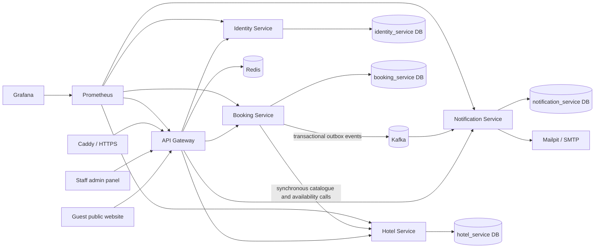

# Architecture

## Purpose and current scope

Hotel Booking is a small hotel-management and guest-booking system built as a practical microservices project. It supports multiple hotels, although the current product flow is focused on one property at a time.

The system is intentionally split where the domains have distinct responsibilities, while keeping deployment simple: the current staging environment runs the complete stack on one EC2 host with Docker Compose. This is not a claim that every system needs microservices; it is a deliberate learning architecture with production-minded boundaries.

## System overview

## Application services

| Component | Responsibility | Owns |
|---|---|---|
| **API Gateway** | Single API entry point, routing, CORS, correlation IDs, Redis-backed rate limits, and aggregated Swagger UI in development. | No business data. |
| **Identity Service** | Staff/customer identities, roles, permissions, assigned hotels, login, refresh tokens, and JWT issue/validation. | `identity_service` database. |
| **Hotel Service** | Hotels, translated room types, physical rooms, rates, booking policies, and dated room-unavailability blocks. | `hotel_service` database. |
| **Booking Service** | Public availability search, reservation lifecycle, pricing snapshots, room-type capacity validation, automatic physical-room assignment, reassignment validation, guest links, discount codes, and outbox events. | `booking_service` database. |
| **Notification Service** | Consumes reservation events and sends notifications through the `EmailSender` abstraction. | `notification_service` database. |

Each service owns its database. Services never read or write another service's schema directly.

## Client applications

| Client | Current role | Connection |
|---|---|---|
| **Admin web** | React + TypeScript + Vite application for owners, managers, and staff. It manages inventory, rates, policies, users, reservations, room reassignment, and the room-availability calendar. | In local development, Vite proxies `/api` to the gateway. |
| **Public web** | React + TypeScript + Vite guest website. Guests browse a hotel, search date-specific room-type availability and prices, then request a booking without an account. | In local development, Vite proxies `/api` to the gateway. |

The frontends are currently development applications, not independently containerized or included in the staging deployment pipeline. Their production hosting and hotel-selection strategy are later work. The public website currently chooses the first configured hotel as a temporary development shortcut; the intended future approach is host-based resolution, such as one subdomain per hotel.

## Main request and event flows

### Staff management request

1. Admin web sends an authenticated request to the API gateway.
2. The gateway forwards the request to the responsible service.
3. The service validates the JWT, permissions, and hotel assignment where relevant.
4. The service reads or writes only its own database and returns the response through the gateway.

### Public availability and booking

1. Public web calls `booking-service` through the gateway with hotel, dates, and guest count.
2. Booking-service requests room-type/rate and eligible physical-room data from hotel-service using REST.
3. Booking-service combines that data with its own reservations and holds, returning only available **room types** and their total stay prices. Physical room numbers are never shown to guests.
4. On booking creation, booking-service revalidates availability, freezes the price snapshot, records the reservation, and automatically assigns a suitable physical room internally.
5. A reservation item retains both the booked room type and its internal room assignment. Staff may change the assignment later, subject to availability validation.

### Notification delivery

1. Booking-service writes its business change and an outbox event in the same database transaction.
2. A scheduled outbox dispatcher publishes pending events to Kafka.
3. Notification-service consumes the event and sends email through `EmailSender`.
4. Delivery failures are retried with backoff; unprocessable Kafka messages go to a dead-letter topic for investigation/recovery.

The transactional outbox avoids the classic failure mode where a reservation commits but its notification event is lost.

## Data and persistence

- **PostgreSQL 17** runs as one local/staging container with four separate databases: `identity_service`, `hotel_service`, `booking_service`, and `notification_service`.
- **Flyway** owns schema evolution. Each service has a V1 creation migration; subsequent schema changes must be new versioned migrations, never edits to an already-applied migration.
- **Hibernate/JPA** maps each service's own entities. Production-style PostgreSQL profiles use Flyway rather than Hibernate schema updates.
- **Redis 7** is used for gateway rate limiting and hotel-service caching. Cache failures are logged and treated as cache misses, allowing PostgreSQL reads to continue.

## Security

- Identity-service issues signed JWT access tokens containing identity, roles, permissions, and assigned hotel IDs.
- Gateway and downstream services validate the same JWT secret in the current scope. In a larger deployment this can evolve to asymmetric signing/key distribution or an external identity provider.
- Authorisation is permission-based; hotel-scoped operations additionally verify that a staff user is assigned to the target hotel.
- Guests can book without an account. Guest access links use cryptographically random tokens stored only as hashes and expire after checkout plus a configured grace period.
- Public write endpoints have Redis-backed, IP-keyed gateway rate limits.
- Caddy is the only public staging entry point. It terminates HTTPS, redirects HTTP, adds security headers, strips spoofed forwarded headers, and proxies `/api/*` to the gateway.
- Secrets are not committed. Local Compose defaults are development-only; staging runtime values are retrieved from AWS Systems Manager Parameter Store.

## Observability and documentation

- Every service exposes Spring Boot Actuator health, info, and Prometheus metrics endpoints.
- API gateway creates or forwards `X-Correlation-Id`; services log it and booking-service propagates it to synchronous hotel-service requests.
- Prometheus scrapes the gateway and services every 15 seconds.
- Grafana dashboards are provisioned from version-controlled definitions.
- Springdoc/OpenAPI provides Swagger UI only when `USE_SWAGGER=true`; it is disabled in staging.

## Local runtime stack

`docker-compose.yml` starts:

- five Spring Boot services;
- PostgreSQL, Redis, Kafka, and Mailpit;
- Prometheus and Grafana;
- the API gateway on `http://localhost:8080`.

The service ports are also exposed locally for diagnostics: hotel `8081`, booking `8082`, identity `8083`, and notification `8084`. Grafana is `3001`, Prometheus `9090`, Mailpit `8025`, and Kafka `9092`.

## Deployment and CI/CD

- **GitHub Actions** runs Maven verification, validates Docker Compose, and builds Docker images for pushes and pull requests targeting `main`.
- **Terraform** defines the AWS staging environment in `eu-west-3`: VPC, security group, Elastic IP, Amazon Linux 2023 EC2 host, Systems Manager access, an S3 deployment-artifact bucket, and GitHub OIDC deployment role.
- The staging host is administered through AWS Systems Manager Session Manager; SSH is not exposed.
- A manual deployment workflow delivers the repository artifact from GitHub to the host using short-lived OIDC credentials and Systems Manager. The host reads secrets from Parameter Store and starts the staging Compose override.
- The current host builds service images sequentially from source. A later improvement is CI-built immutable images stored in a registry.

## Intentional current limitations and next evolution

- The public/admin frontends need production hosting, CI builds, and deployment integration.
- Public hotel resolution must move from “first hotel” to a configured hostname or explicit hotel selection.
- Internal synchronous calls currently use configured service URLs. Service discovery and/or a service mesh are not needed for the current single-host Compose deployment, but are valid future learning steps.
- Kafka is self-managed in Compose. AWS MSK, SQS/SNS, or a managed Kafka provider are deployment alternatives, not application-level requirements.
- The calendar currently provides a weekly all-rooms view. A monthly single-room calendar and richer drag/drop operational planning can be added without changing the core domain model.
